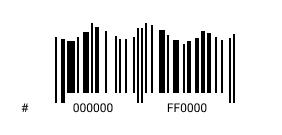

<p>
  <h1 align="center">Red Williams</h1>
</p>
<p align="center">
  
</p>
<p align="center">
  
</p>

`Info.js`

```js
const redwilliams = {
  pronouns:    ["he/him", "they/them"],
  contact:     "redpwilliams@gmail.com",
  description: "Hi!👋🏾 I'm a Computer Engineering student and avid developer!",
  code:        ["Typescript, Java, C],
  passions:    ["Music", "Coding", "Videogames", "Anime"],
  futureEndeavors: ["Game Development", "Blender Modeling", "UX/UI Design"],
  website: "https://redwilliams.dev"
};
```

<p align="center">Check out my repos ⬇️</p>

<!--
**Red-CS/Red-CS** is a ✨ _special_ ✨ repository because its `README.md` (this file) appears on your GitHub profile.

Here are some ideas to get you started:

- 🔭 I’m currently working on ...
- 🌱 I’m currently learning ...
- 👯 I’m looking to collaborate on ...
- 🤔 I’m looking for help with ...
- 💬 Ask me about ...
- 📫 How to reach me: ...
- 😄 Pronouns: ...
- ⚡ Fun fact: ...
-->
